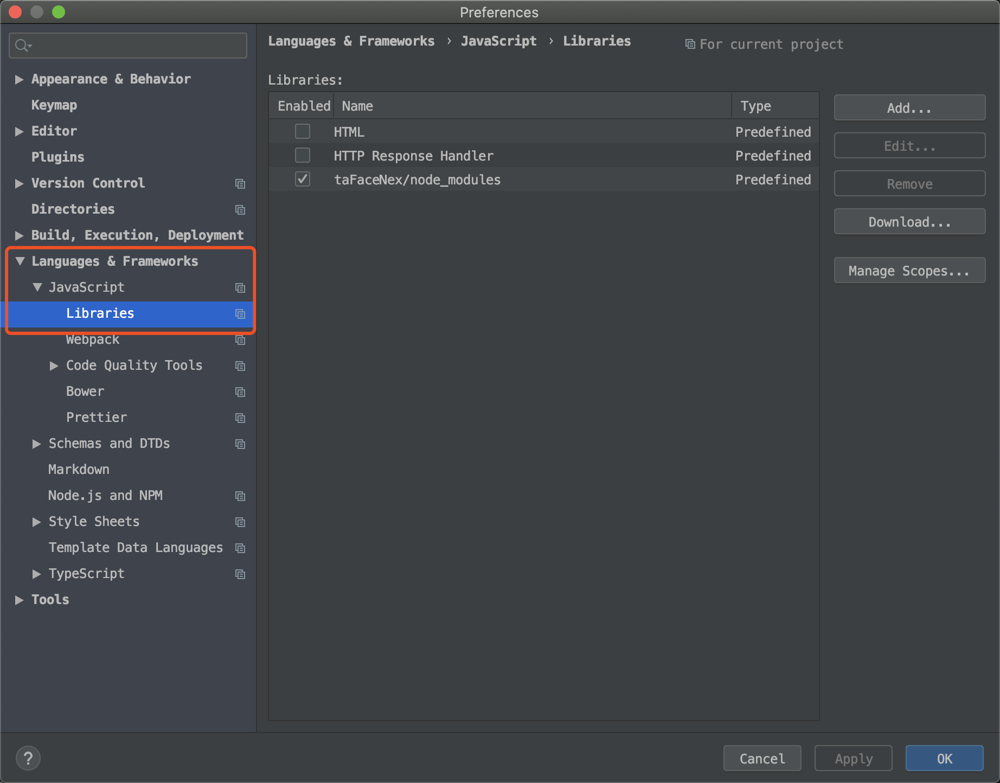
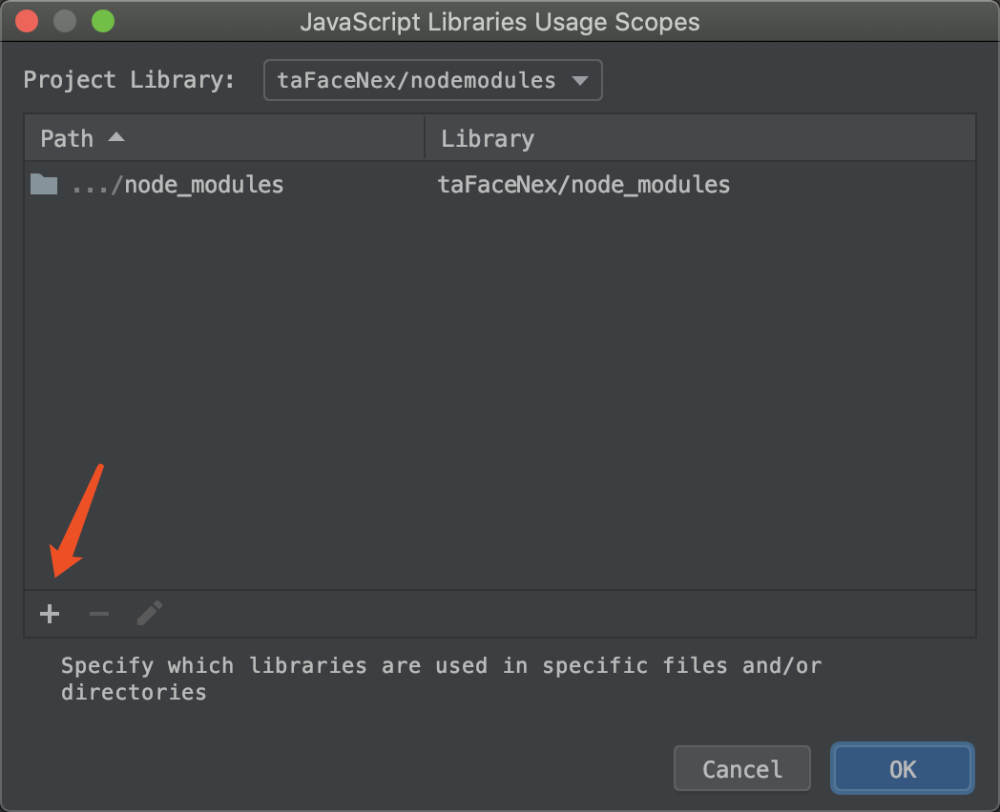
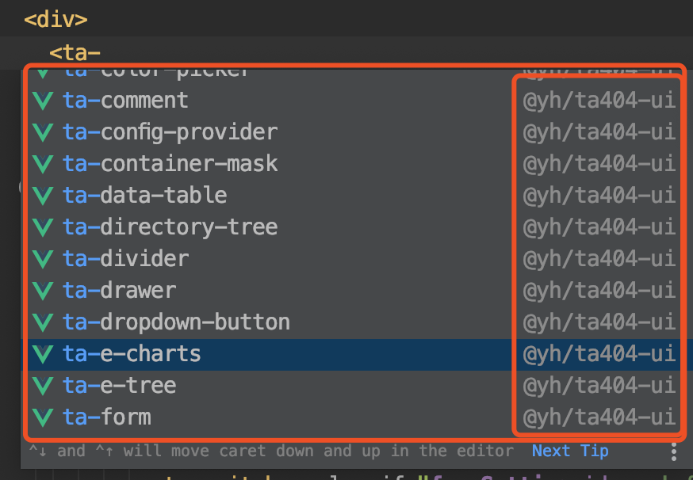

## 在WebStorm中编写vue文件时智能提示@yh/ta404-ui的标签

由于这个功能`标签及其属性、文档智能提示`使用的是`WebStorm`提供的`web-types`功能，此功能从两方面来实现。
1. 模块的`package.json`文件中的`web-types`字段指向包含指定格式的`web-types.json`文件
1. `WebStorm`的IDE支持（无需自己实现）。

### 系统要求
1. `@yh/ta404-ui`需要1.2.1-7版本及以上，此版本开始，发布包中会自动包含`web-types`的支持
1. `WebStorm`需要2019.3以上（仅测试了2019.3版本）
1. `IDEA`或其他`JetBrains`全家桶需要2019.3以上（仅测试IDEA2019.3版本），需要安装`Vue.js`插件

### 步骤

1. 打开设置,依次点击,`Language & Frameworks` -> `JavaScript` -> `Libraries`,显示如下

1. 点击`Manage Scope...`按钮后,出现如下的界面。点击`+`按钮,然后选择到 `项目根目录/node_modules/@yh/ta404-ui`目录

1. 此时,WebStorm会自动检索该目录,以生成index文件缓存,稍等片刻即可。

1. 索引完成后,打开vue文件，即可开始输入标签。如下所示

**注意：** 如果未出现如上图所示的提示，只需要重新启动WebStorm即可。

### 优点

1. 无需安装插件，降低`WebStorm`崩溃的概率
1. 使用`WebStorm`自带API，没有任何其他依赖
1. 与`@yh/ta404-ui`版本无关（1.2.1版本以后）
1. 可用于任何依赖：前提是这个模块实现了`web-types`

### 缺点

1. 在使用前必须执行`npm install`
1. 模块必须实现了`web-types`

### 注意

1. 在`npm install`之后，`WebStorm`需要一段时间来进行`index`，并且，在`index`之后需要一小段时间（一般不超过3分钟）来进行后台分析等操作。在此段时间内，无法使用标签智能提示功能。
